# WebAssembly

极客时间 专栏课 学习总结  

Wasm 其实是一种基于“堆栈机模型” 设计的 V-ISA 指令集。

## 1. WebAssembly 模块的基本组成结构

每一个 Wasm 模块都是由多个不同种类的 Section 组成的，这些 Section 按照其专有 ID 从小到大的顺序被依次摆放着。可以直接把它想象成，一个个具有特定功能的一簇二进制数据。  

### 1.1. Section 概览

通常，为了能够更好地组织模块内的二进制数据，我们需要把具有相同功能，或者相关联的那部分二进制数据摆放到一起。而这些被摆放在一起，具有一定相关性的数据，便组成了一个个 Section。  

每一个不同的 Section 都描述了关于这个 Wasm 模块的一部分信息。而模块内的所有 Section 放在一起，便描述了整个模块在二进制层面的组成结构。在一个标准的 Wasm 模块内，以现阶段的 MVP 标准为参考，可用的 Section 有如下几种。  

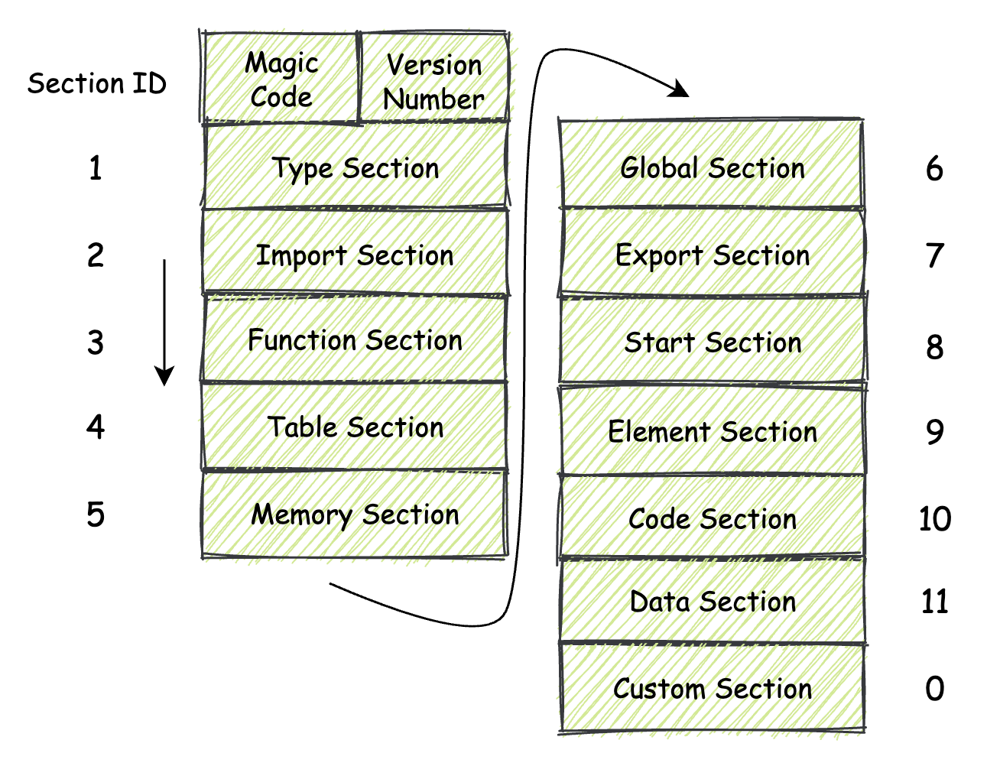

除了其中名为 “Custom Secton”，也就是“自定义段”这个 Section 之外，其他的 Section 均需要按照每个 Section 所专有的 Section ID，按照这个 ID 从小到大的顺序，在模块的低地址位到高地址位方向依次进行“摆放”。  

### 1.2. 单体 Section

这一类 Section 一般可以独自描述整个模块的一部分特征（或者说是功能），同时也可以与其他 Section 一起配合起来使用。  

#### 1.2.1 Type Section


这个 Section 用来存放与“类型”相关的东西。而这里的类型，主要是指“函数类型”。  
函数类型一般由函数的参数和返回值两部分组成。  

将 Type Section 的组成内容分为如下两个部分，分别是：所有 Section 都具有的通用“头部”结构，以及各个 Section 所专有的、不同的有效载荷部分。  

从整体上来看，每一个 Section 都由有着相同结构的“头部”作为起始，在这部分结构中描述了这个 Section 的一些属性字段，比如不同类型 Section 所专有的 ID、Section 的有效载荷长度。除此之外还有一些可选字段，比如当前 Section 的名称与长度信息等等。关于这部分通用头部结构的具体字段组成.  

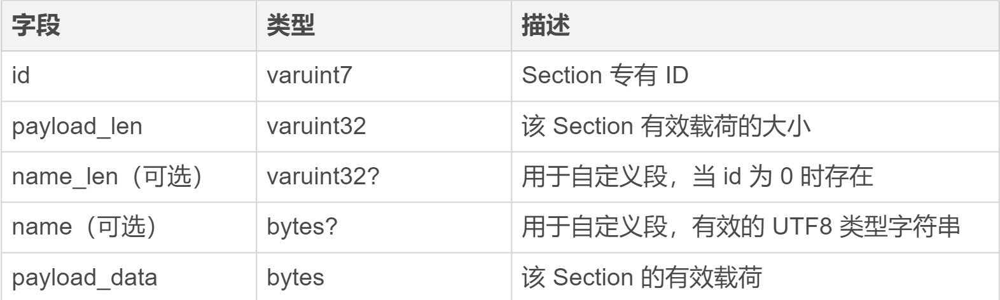

对于表中第二列给出的一些类型，将它们理解为一种特定的编码方式,“字段”这一列中的 “name_len” 与 “name” 两个字段主要用于 Custom Section，用来存放这个 Section 名字的长度，以及名字所对应的字符串数据。  

对于 Type Section 来说，它的专有 ID 是 1。紧接着排在“头部”后面的便是这个 Section 相关的有效载荷信息（payload_data）。注意，每个不同类型的 Section 其有效载荷的结构都不相同。比如，Type Section 的有效载荷部分组成如下表所示。  

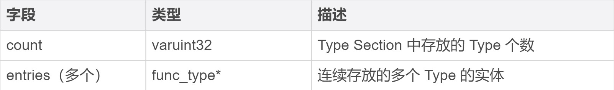

Type Section 的有效载荷部分是由一个 count 字段和多个 entries 字段数据组合而成的。其中要注意的是 entries 字段对应的 func_type 类型，该类型是一个复合类型，其具体的二进制组成结构又通过另外的一些字段来描述.  

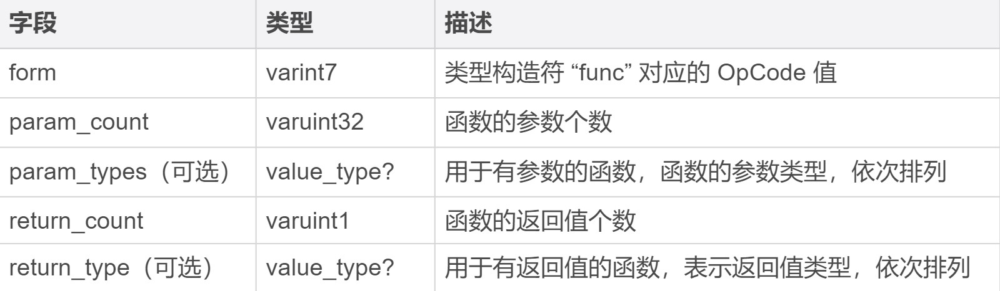

#### 1.2.2. Start Section


Start Section 的 ID 为 8。通过这个 Section，我们可以为模块指定在其初始化过程完成后，需要首先被宿主环境执行的函数。  

所谓的“初始化完成后”是指：模块实例内部的线性内存和 Table，已经通过相应的 Data Section 和 Element Section 填充好相应的数据，但导出函数还无法被宿主环境调用的这个时刻。  

对于 Start Section 来说，有一些限制是需要注意的，比如：一个 Wasm 模块只能拥有一个 Start Section，也就是说只能调用一个函数。并且调用的函数也不能拥有任何参数，同时也不能有任何的返回值。  

#### 1.2.3. Global Section


Global Section 的 ID 为 6。这个 Section 中主要存放了整个模块中使用到的全局数据（变量）信息。这些全局变量信息可以用来控制整个模块的状态，可以直接把它们类比为我们在 C/C++ 代码中使用的全局变量。  

在这个 Section 中，对于每一个全局数据，我们都需要标记出它的值类型、可变性（也就是指这个值是否可以被更改）以及值对应的初始化表达式（指定了该全局变量的初始值）。  

#### 1.2.4. Custom Section

Custom Section 的 ID 为 0。这个 Section 主要用来存放一些与模块本身主体结构无关的数据，比如调试信息、source-map 信息等等。VM（Virtual Machine，虚拟机）在实例化并执行一个 Wasm 二进制模块中的指令时，对于可以识别的 Custom Section，将会以特定的方式为其提供相应的功能。而 VM 对于无法识别的 Custom Section 则会选择直接忽略。  

VM 对于 Custom Section 的识别，主要是通过它 “头部”信息中的 “name” 字段来进行。在目前的 MVP 标准中，有且仅有一个标准中明确定义的 Custom Section，也就是 “Name Section”。这个 Section 对应的头部信息中，“name” 字段的值即为字符串 “name”。在这个 Section 中存放了有关模块定义中“可打印名称”的一些信息。  

### 1.3. 互补 Section

每一组的两个 Section 共同协作，一同描述了整个 Wasm 模块的某方面特征。

#### 1.3.1. Import Section 和 Export Section

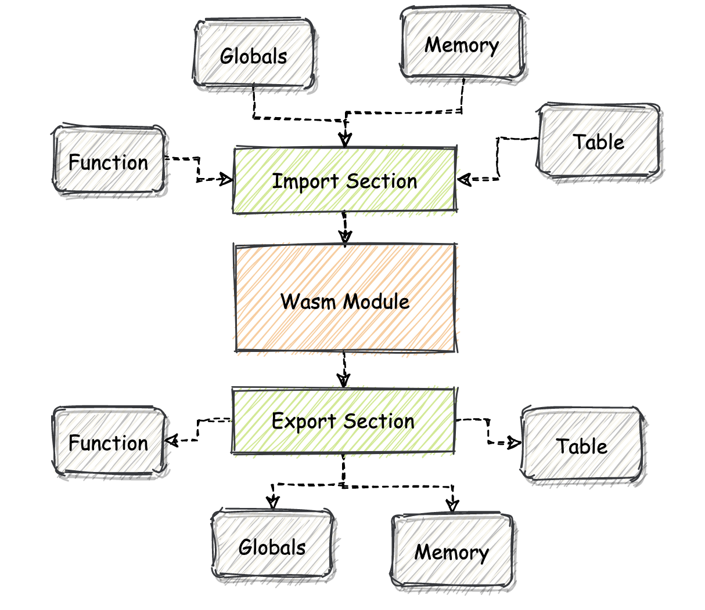

Import Section，它的 ID 为 2。Import Section 主要用于作为 Wasm 模块的“输入接口”。在这个 Section 中，定义了所有从外界宿主环境导入到模块对象中的资源，这些资源将会在模块的内部被使用。  

允许被导入到 Wasm 模块中的资源包括：函数（Function）、全局数据（Global）、线性内存对象（Memory）以及 Table 对象（Table）。那为什么要设计 Import Section 呢？其实就是希望能够在 Wasm 模块之间，以及 Wasm 模块与宿主环境之间共享代码和数据。  

与 Import Section 类似，既然我们可以将资源导入到模块，那么同样地，我们也可以反向地将资源从当前模块导出到外部宿主环境中。  

Export Section 的 ID 为 7，通过它，我们可以将一些资源导出到虚拟机所在的宿主环境中。允许被导出的资源类型同 Import Section 的可导入资源一致。而导出的资源应该如何被表达及处理，则需要由宿主环境运行时的具体实现来决定。  

#### 1.3.2. Function Section 和 Code Section

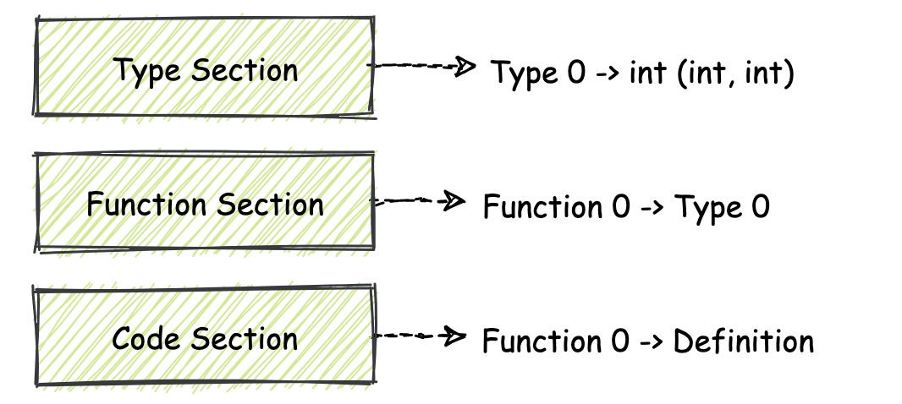

在 Wasm 标准中，所有模块内使用到的函数都会通过整型的 indicies 来进行索引并调用。  

你可以想象这样一个数组，在这个数组中的每一个单元格内都存放有一个函数指针，当你需要调用某个函数时，通过“指定数组下标”的方式来进行索引就可以了。  

Type Section 存放了 Wasm 模块使用到的所有函数类型（签名）；Function Section 存放了模块内每个函数对应的函数类型，即具体的函数与类型对应关系；而在 Code Section 中存放的则是每个函数的具体定义，也就是实现部分。  

Code Section 的 ID 为 10。Code Section 的组织结构从宏观上来看，你同样可以将它理解成一个数组结构，这个数组中的每个单元格都存放着某个函数的具体定义，也就是函数体对应的一簇 Wasm 指令集合。  

每个 Code Section 中的单元格都对应着 Function Section 这个“数组”结构在相同索引位置的单元格。也就是说举个例子，Code Section 的 0 号单元格中存放着 Function Section 的 0 号单元格中所描述函数类型对应的具体实现。  

#### 1.3.3. Table Section 和 Element Section

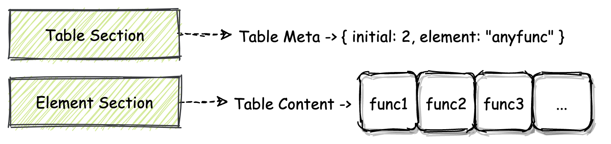

可以在其对应的 Table 结构中存放类型为 “anyfunc” 的函数指针，并且还可以通过指令 “call_indirect” 来调用这些函数指针所指向的函数，这就可以了。Table Section 的结构与 Function Section 类似，也都是由“一个个小格子”按顺序排列而成的.  

#### 1.3.4. Memory Section 和 Data Section

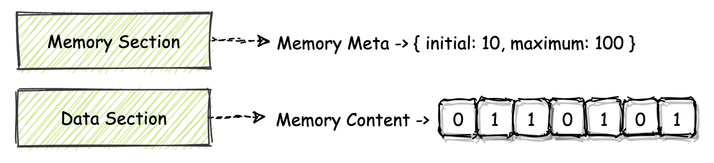

Memory Section 的 ID 为 5。同 Table Section 的结构类似，借助 Memory Section，可以描述一个 Wasm 模块内所使用的线性内存段的基本情况，比如这段内存的初始大小、以及最大可用大小等等.  

Wasm 模块内的线性内存结构，主要用来以二进制字节的形式，存放各类模块可能使用到的数据，比如一段字符串、一些数字值等等。  

通过浏览器等宿主环境提供的比如 WebAssembly.Memory 对象，我们可以直接将一个 Wasm 模块内部使用的线性内存结构，以“对象”的形式从模块实例中导出。而被导出的内存对象，可以根据宿主环境的要求，做任何形式的变换和处理，或者也可以直接通过 Import Section ，再次导入给其他的 Wasm 模块来进行使用。  

在 Memory Section 中，也只是存放了描述模块线性内存属性的一些元信息，如果要为线性内存段填充实际的二进制数据，我们还需要使用另外的 Data Section。Data Section 的 ID 为 11。  

### 1.2. 魔数和版本号

同 ELF 二进制文件一样，Wasm 也同样使用“魔数”来标记其二进制文件类型。所谓魔数，你可以简单地将它理解为具有特定含义 / 功能的一串数字。  

一个标准 Wasm 二进制模块文件的头部数据是由具有特殊含义的字节组成的。其中开头的前四个字节分别为  “（高地址）0x6d 0x73 0x61 0x0（低地址）”，这四个字节对应的 ASCII 可见字符为 “asm”（第一个为空字符，不可见）。  

接下来的四个字节，用来表示当前 Wasm 二进制文件所使用的 Wasm 标准版本号。就目前来说，所有 Wasm 模块该四个字节的值均为 “（高地址）0x0 0x0 0x0 0x1（低地址）”，即表示版本 1。在实际解析执行 Wasm 模块文件时，VM 也会通过这几个字节来判断，当前正在解析的二进制文件是否是一个合法的 Wasm 二进制模块文件。  

使用以下 C/C++ 代码所对应生成的 Wasm 二进制字节码来作为例子

```c++
int add (int a, int b) {
  return a + b;
}
```

使用一个线上的名为 WasmFiddle 的在线 Wasm 编译工具，将上述代码编译成对应的 Wasm 二进制文件，然后，我们可以使用 “hexdump” 命令来查看这个二进制文件的字节码内容。

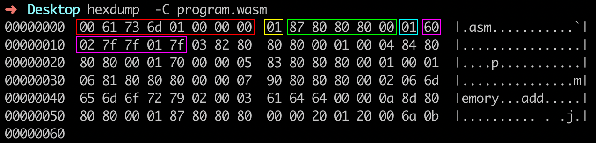

最开始红色方框内的前八个字节 “0x0 0x61 0x73 0x6d 0x1 0x0 0x0 0x0” 便是我们之前介绍的， Wasm 模块文件开头的“魔数”和版本号。这里需要注意地址增长的方向是从左向右。  

接下来的 “0x1” 是 Section 头部结构中的 “id” 字段，这里的值为 “0x1”，表明接下来的数据属于模块的 Type Section。紧接着绿色方框内的五个十六进制数字 “0x87 0x80 0x80 0x80 0x0” 是由 varuint32 编码的 “payload_len” 字段信息，经过解码，它的值为 “0x7”，表明这个 Section 的有效载荷长度为 7 个字节。  

Type Section 的有效载荷是由一个 “count” 字段和多个 “entries” 类型数据组成的。因此我们可以进一步推断出，接下来的字节 “0x1” 便代表着，当前 Section 中接下来存在的 “entries” 类型实体的个数为 1 个。  

紫色方框内的六个十六进制数字序列 “0x60 0x2 0x7f 0x7f 0x1 0x7f” 便代表着“一个接受两个 i32 类型参数，并返回一个 i32 类型值的函数类型”.  

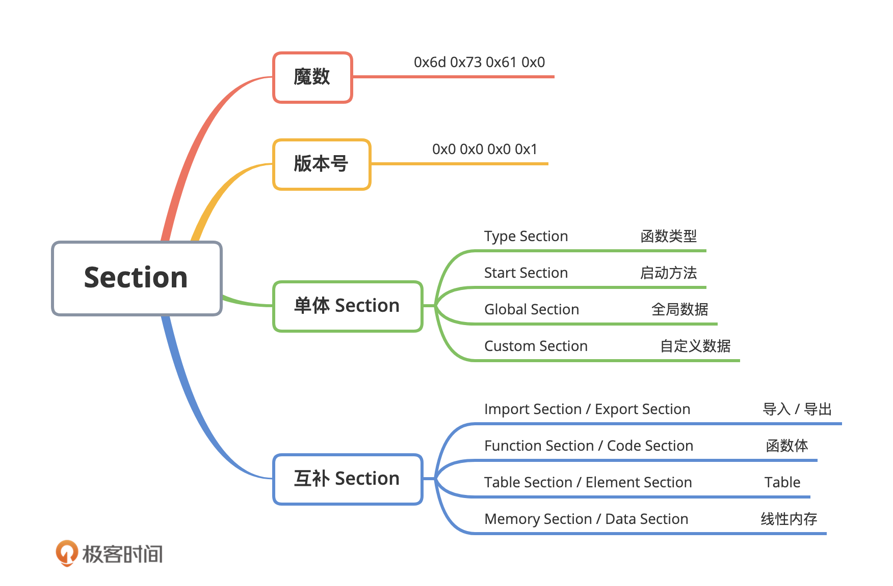

## 2. WebAssembly基本数据规则

### 2.1. 字节序

字节序也就是指“字节的排列顺序”。在计算机中，数据是以最原始的二进制 0 和 1 的方式被存储的。在大多数现代计算机体系架构中，计算机的最小可寻址数据为 8 位（bit)，即 1 个字节（byte）。  

通常将 1 字节定义为一个存储单元的大小。对于连续占用了多个存储单元的数据，我们通常称之为“多字节数据”，组成这段数据的每个字节都会地址连续地进行存放。  

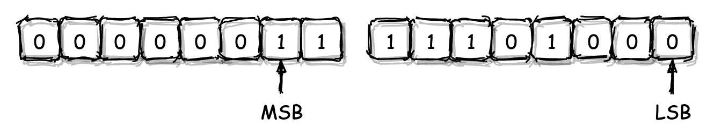

对于一个多字节数据，我们会将其二进制形式下，用于组成该数字值的最低有效数字位与最高有效数字位，分别称为这个数据的“最低有效位（LSB，Least Significant Bit）”和“最高有效位（MSB，Most Significant Bit）”。如上图我们所标记出的那样。  

而当计算机将这个多字节数据存放到物理内存中时，一个对于存储方式的不同抉择便出现了。  

应该选择将多字节数据的 LSB 位，存放到物理内存的低地址段（也就是相应地把 MSB 位存放到高地址段）；还是相反地，应该将多字节数据的 LSB 位，存放到物理内存的高地址段（即将 MSB 位相应地存放到低地址段）呢？实际上这两种方式均有被业界所使用，它们分别被称为“小端模式”与“大端模式”。  

#### 2.1.1. 小端模式（Little-Endian）

小端模式即“将多字节数据的 LSB 位存放到内存的低地址位，相应地将 MSB 位存放到内存的高地址位”。  

存储着值 1000 的 short 类型变量，在以“小端模式”进行存放时的内存结构图。  

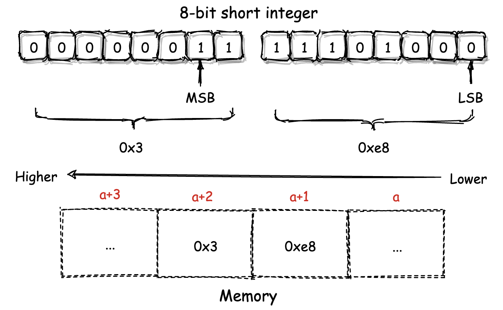

这个 short 类型变量值的 LSB 位所对应的低 8 位数据（0xe8），被存放到了内存的低地址位单元（a+1）中。 MSB 位对应的高 8 位数据（0x3）则被存放到了内存的高地址单元（a+2）中。而这便是“小端模式”所独有的特征。  

#### 2.1.2. 大端模式（Big-Endian）

与小端模式相反，在大端模式下，多字节数据的 LSB 位所对应部分会被存放到内存的高地址位，而 MSB 对应的部分则会被存放到内存的低地址位。也就是说，将上图内存中两个存储单元所存放的数据 0x3 与 0xe8 的位置相互调换后，便是大端模式下的数据存储方式。  

### 2.2. LEB-128 整数编码

LEB-128 的全称为 “Little Endian Base 128”，是一种用于整数的、基于小端模式的可变长编码。所谓“可变长编码”，是指源数据在经过编码后，所得到的目标编码结果长度并不固定。依据不同的输入数据会得到不同长度的编码结果。  

LEB-128 编码通常可以被分为两种更为具体的形式，即 “Unsigned LEB-128” 与 “Signed LEB-128”。其中前者仅用于编码无符号整数，后者主要用于编码有符号整数。  

在无符号整数中，没有符号位，也就是说在该类型所对应大小范围内的所有比特位，都可以用来保存整数值的一部分。相反，在有符号整数中，类型首位会被用作符号位。  

#### 2.2.1. Unsigned LEB-128

使用 Unsigned LEB-128 来编码一个正整数 123456。编码的具体步骤如下所示。  

1. 首先将该十进制数转换为对应原码（与补码相同）的二进制表示方式。

```text
11110001001000000
```

2. 将该二进制数用额外的 “0” 位进行填充，直至其总位数达到最近的一个 7 的倍数。注意这里我们只能够在该数字最高位的左侧进行填充，这样才不会影响数字原本的值。这种为无符号数进行位数扩展的方式我们一般称之为“零扩展”。

```text
000011110001001000000
```

3. 将该二进制数以每 7 个二进制位为一组进行分组，每组之间以空格进行区分。

```text
0000111 1000100 1000000
```

4. 在最高有效位所在分组的左侧填充一个值为 “0” 的二进制位。而在其他分组的最高位左侧填充一个值为 “1” 的二进制位。  

```text
00000111 11000100 11000000
```

5. 将上述二进制位分组以每组为单位，转换成对应的十六进制值，即为编码所得结果。

```text
0x7 0xc4 0xc0
```

对于 Unsigned LEB-128 编码的解码过程，实质上与编码过程完全相反.  

#### 2.2.2. Signed LEB-128

Signed LEB-128 的编码过程，实质上与 Unsigned LEB-128 十分类似.  

用它来编码一个有符号的负整数 -123456。编码的具体流程如下所示。  

1. 首先，我们需要将该数字转换为对应的二进制表示形式。这里需要注意的是，由于 -123456 为一个有符号数，因此在编码时我们需要使用它的补码形式。在下面这段二进制编码中，第一位是符号位，这里的 “1” 表示该二进制序列所对应的十进制数是一个负数。  

```text
100001110111000000
```

2. 在这一步中，我们需要对这个有符号数进行“符号扩展”操作。所谓“符号扩展”是指对二进制数的最高位，也就是符号位，其左侧填充指定的二进制位来增加整个有符号数的总位数，并同时保证该二进制数本身的值不会被改变。  

因此，对于负整数来说，我们需要为其填充 “1”，而正整数则填充 “0”。与 Unsigned LEB-128 类似，这里我们要对其进行符号扩展，直到这个二进制数的总位数达到最近的一个 7 的倍数。  

```text
111100001110111000000
```

3. 将这个二进制数以每 7 个二进制位为一组进行分组，每组之间以空格进行区分。1111000 0111011 1000000

```text
1111000 0111011 1000000
```

4. 同样地，在最高有效位所在分组的左侧填充一个值为 “0” 的二进制位。而在其他分组的最高位左侧填充一个值为 “1” 的二进制位。

```text
01111000 10111011 11000000
```

5. 将上述二进制分组以每组为单位，转换成对应的十六进制值，即为编码所得结果。

```text
0x78 0xbb 0xc0
```

Signed LEB-128 与 Unsigned LEB-128 在编码规则上的不同，仅体现在整个编码 流程的前两步。这两步的不同主要是由于无符号数与有符号数在计算机内的实际存储方式不同。  

### 2.3. IEEE-754 浮点数编码

IEEE-754 是一种用于进行浮点数编码的行业标准。你几乎可以在任何与浮点数编码有关的应用场景中看到它的存在。  

在 IEEE-754 标准中规定，一个浮点数由三个不同的部分组成，即“符号位”、“指数位”与“小数位”。这里我们以 32 位浮点数 “1234.567” 为例，来介绍它在 IEEE-754 下的实际编码结构。  

首先，32 位的最高位，也就是其 MSB 位会被符号位占用，以标记该浮点数的正负性。同整数一样，该位为 “0” 表示正数，为 “1” 则表示负数。因此对于 “1234.567” 来说，该位的值为 0。  

紧接着符号位的是长度为 8 位的“指数位”。该位用来记录的是，当以“科学计数法”形式表示一个浮点数时，表示法中底数所对应的幂次值。这里我们需要将小数编码成对应的二进制形式，因此所使用科学计数法的底数为 “2”。  

指数位采用了一种名为“移码”的值存储方法，以便能支持负数次幂。当我们计算该位的实际值时，会将从上一步中得到的幂次值与 127 相加，以得到该位的最终结果。对于 “1234.567”，我们可以按照如下步骤来计算对应的指数位值。  

第一步，将浮点数按照整数位和小数位，分别转换成对应的二进制表示形式（对于小数部分，这里我们采用“循环乘 2”的方式，来将其展开成二进制形式）。  

```text
10011010010.10010001001001...
```

第二步，将从上一步得到的二进制小数，以“科学计数法”的形式进行表示。  

```text
1.001101001010010001001001... * 2^10
```

第三步，计算指数位对应的十进制数值。即将上述 2 的幂次值 10，再加上 127，得到 137。换算成二进制序列即 “10001001”。  

紧接着指数位的是剩下 23 位的“小数位”，该位主要用于存放浮点数在二进制科学计数法形式下，对应的小数部分序列（也就是在上述第二步我们得到的二进制序列中，小数点后面的那部分）。但要注意的是，这部分只有 23 位大小，对于溢出的部分将会被直接截断。  

最后，我们可以得到浮点数 1234.567 在 IEEE-754 编码下的完整组成形式，如下图所示。

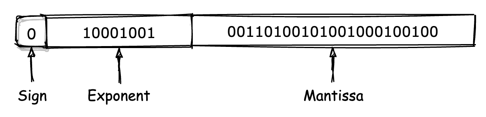

### 2.3. UTF-8 字符串编码

与 LEB-128 类似，UTF-8 也是一种可变长编码，即随着被编码内容的不同，实际产生的编码结果其长度也各不相同。如下图所示，UTF-8 的编码结果值可能会有着从最少 1 个字节到最多 4 个字节不等的长度。  

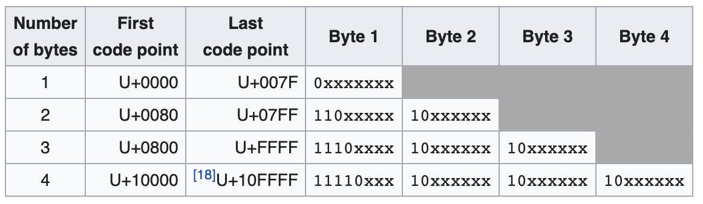

UTF-8 的编码过程是基于 Unicode 字符集进行的。在 Unicode 字符集中，每一个字符都有其对应的码位值。比如对于汉字 “极”，它在 Unicode 字符集中的码位值为 “26497”，换算为十六进制即 “0x6781”。因此，我们说，汉字“极”对应的 Unicode 码位值便为 “U+6781”。  

以汉字“极”为例，来介绍 UTF-8 编码的具体过程。  

第一步，我们先将该汉字对应的码位值展开成二进制序列的形式。  

```text
01100111 10000001
```

第二步，根据上图中第三行对应的规则（码位值位于 [U+0800, U+FFFF] 之间），替换出 UTF-8 编码对应的三个字节。在替换时，你需要将从上一步获得的二进制序列中的各个二进制位，按照从左到右的顺序依次替换掉 UTF-8 编码中用于占位的 “x”。  

```text
11100110 10011110 10000001
```

第三步，将替换结果转换为对应的十六进制形式，即为 UTF-8 编码的最终结果。  

```text
0xe6 0x9e 0x81
```

### 2.4. Wasm 数字类型

Wasm 将其模块内部所使用到的数字值分为以下三种类型：  

uintN（N = 8 / 16 / 32）  
该类型表示了一个占用 N 个 bit 的无符号整数。该整数由 N/8 个字节组成，并以小端模式进行存储。N 的可取值为 8、16 或 32。  

varuintN（N = 1 / 7 / 32）  
该类型表示一个使用 Unsigned LEB-128 编码，具有 N 个 bit 长度的可变长无符号整数。N 的可取值为 1、7 或 32，对应各类型的可取值范围为 [0, 2^N-1]。需要注意的是，当使用较大数据类型（比如 N 取 32）来存放较小的值，比如 12 时，在经过 Unsigned LEB-128 编码后的二进制序列中，可能会存在用于占位的字节 “0x80”。  

varintN（N = 7 / 32 / 64）  
该类型与上述的 varuintN 类似，只不过表示的是使用 Signed LEB-128 编码，具有 N 个 bit 长度的可变长有符号整数。N 的可取值为 7、32 或 64，对应各类型的取值范围为 [-2^(N-1), +2^(N-1)-1]。同样地，当在使用一个较大类型（比如 N 取 64）保存较小的整数值时，经过 Signed LEB-128 编码后的二进制序列中，可能会存在用于占位的字节 “0x80” 或 “0xff”。


